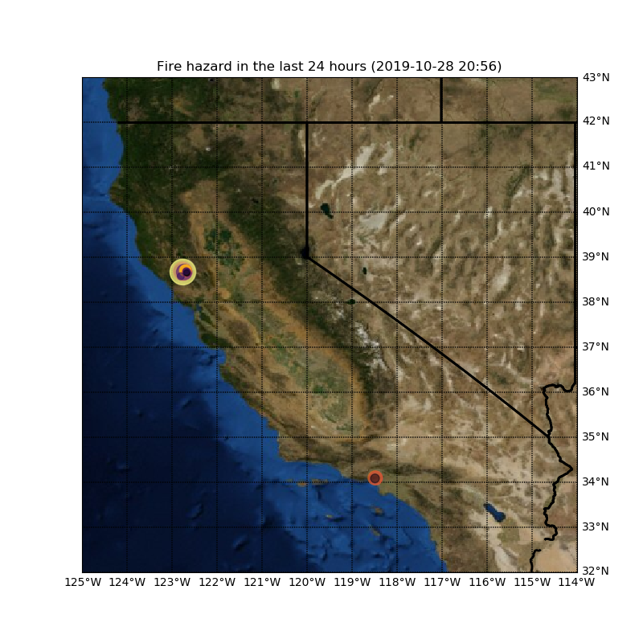

# [High Temperature Anomaly](https://likarajo.github.io/hightemp/)
Fetch data from Nasa and plot areas in California that are prone to having active fires due to temperature anomaly.

<div align="center">
  
</div>

## Data Source
NASA's [Earth Observing System (EOS)](https://eospso.nasa.gov/) Network's data fetched from [Terra](https://terra.nasa.gov/) and [Aqua](https://aqua.nasa.gov/) [MODIS](https://modis.gsfc.nasa.gov/) satellites.

## Process
* The locations of fire hazard are determined by temperature (heat) anomalies detected by the satellite.
* The size of the points corresponds to the FRP (fire Radiative Power)
* The color of the points corresponds to the Brightness Temperature in Kelvin.

## Dependencies
```shell script
pip3 install datetime
pip3 install numpy
pip3 install pandas
conda install matplotlib
conda install basemap
```

## Steps
* Run the python app
```shell script
python hightemp.python
```

## Motivation
California Fires: Fueled by hot weather, low humidity, and bursts of strong easterly and northeasterly winds, several large wildfires ignited along the West Coast of the United States and Mexico in late October 2019. In order to detect in advance and take proactive measures, the data from satellite can be used to spot fire hazards. As a result life and property can be saved.

## Prospects
This project can also be used to plot temperature anomalies around the world using appropriate data API from MODIS, and changing the coordinates of the map used.
